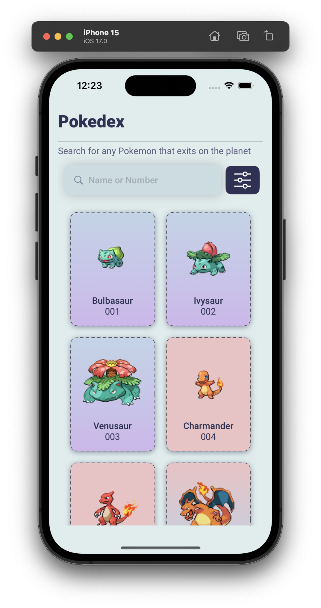
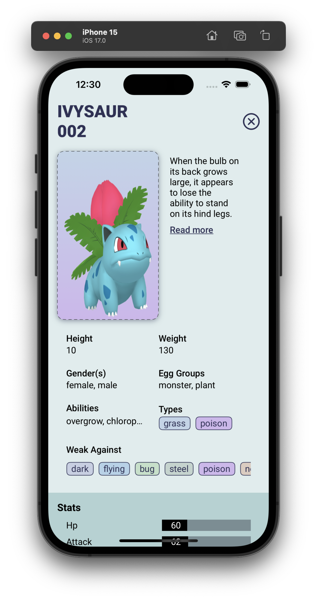

# PokemonRN

## Overview
PokemonRN serves as a comprehensive Pokemon dictionary, capturing data pertaining to various attributes of Pokemon. This application specifically concentrates on the following aspects:

- Name
- Description
- Physical Attributes
- Stats
- Evolution Chain

PokemonRN app represents a straightforward yet potent tool for delving into information about diverse Pokemon. It has been meticulously crafted using React Native and adheres to the Atomic Design Pattern, ensuring a distinct separation of concerns and facilitating ease of maintenance.

## Technologies Used

- **React Native:** Cross-platform mobile app development with native performance.
- **TypeScript:** JavaScript with strong typing for better code reliability.
- **Tanstack react-query:** Powerful data-fetching and state management for React.
- **Atomic Design Pattern:** Modularize code into reusable components for better structure and maintainability.
- **Unit testing with Jest:** Test individual components and functions to ensure quality.
- **Snapshot testing with TestRenderer:** Capture UI snapshots to detect unexpected changes.

## App Screenshots

<strong>List & Detail Screen</strong>

  
  

